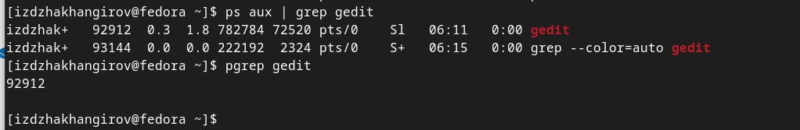
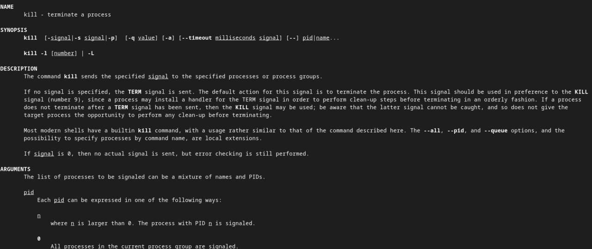
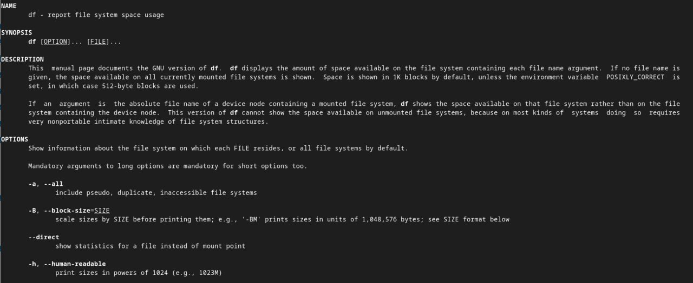
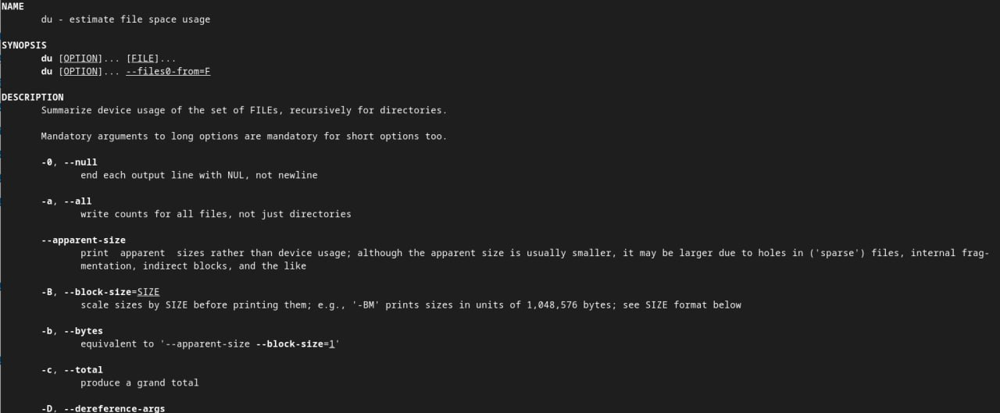
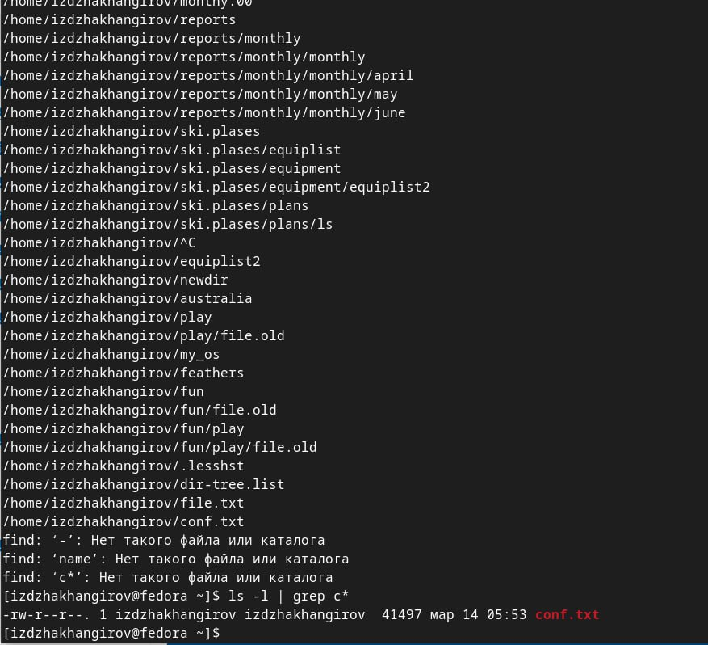
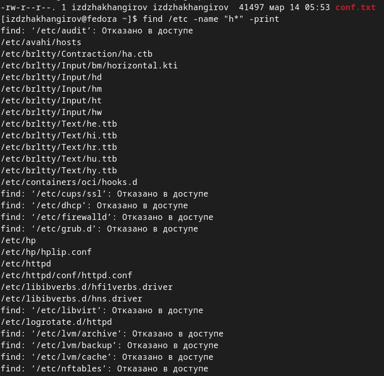
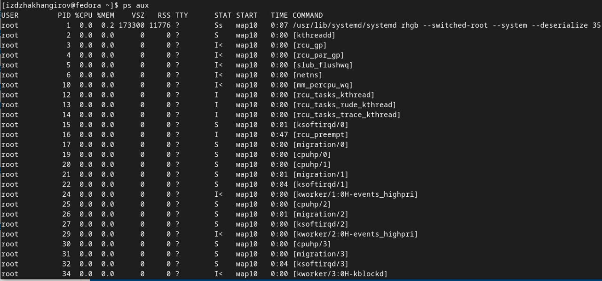
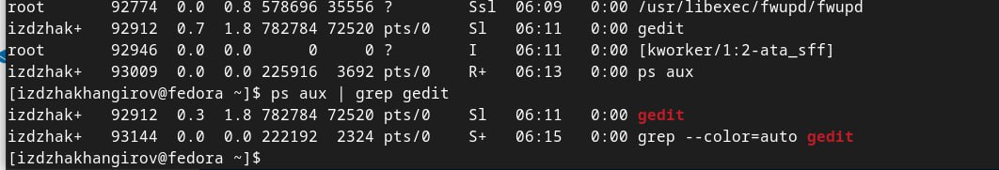

---
## Front matter
title: "Лабораторная работа No 6
subtitle: "Поиск файлов. Перенаправление ввода-вывода. Просмотр запущенных процессов"
author: "Джахангиров илгар залид"

## Generic otions
lang: ru-RU
toc-title: "Содержание"

## Bibliography
bibliography: bib/cite.bib
csl: pandoc/csl/gost-r-7-0-5-2008-numeric.csl

## Pdf output format
toc: true # Table of contents
toc-depth: 2
lof: true # List of figures
lot: false # List of tables
fontsize: 12pt
linestretch: 1.5
papersize: a4
documentclass: scrreprt
## I18n polyglossia
polyglossia-lang:
  name: russian
  options:
	- spelling=modern
	- babelshorthands=true
polyglossia-otherlangs:
  name: english
## I18n babel
babel-lang: russian
babel-otherlangs: english
## Fonts
mainfont: PT Serif
romanfont: PT Serif
sansfont: PT Sans
monofont: PT Mono
mainfontoptions: Ligatures=TeX
romanfontoptions: Ligatures=TeX
sansfontoptions: Ligatures=TeX,Scale=MatchLowercase
monofontoptions: Scale=MatchLowercase,Scale=0.9
## Biblatex
biblatex: true
biblio-style: "gost-numeric"
biblatexoptions:
  - parentracker=true
  - backend=biber
  - hyperref=auto
  - language=auto
  - autolang=other*
  - citestyle=gost-numeric
## Pandoc-crossref LaTeX customization
figureTitle: "Рис."
tableTitle: "Таблица"
listingTitle: "Листинг"
lofTitle: "Список иллюстраций"
lotTitle: "Список таблиц"
lolTitle: "Листинги"
## Misc options
indent: true
header-includes:
  - \usepackage{indentfirst}
  - \usepackage{float} # keep figures where there are in the text
  - \floatplacement{figure}{H} # keep figures where there are in the text
---

# Цель работы

Ознакомится с инструментами поиска файлов и фильтрации текстовых данных.
Приобретение практических навыков: по управлению процессами (и заданиями), по
проверке использования диска и обслуживанию файловых систем

# Задание
1. Осуществите вход в систему, используя соответствующее имя пользователя.
2. Запишите в файл file.txt названия файлов, содержащихся в каталоге /etc. Допи-
шите в этот же файл названия файлов, содержащихся в вашем домашнем каталоге.
3. Выведите имена всех файлов из file.txt, имеющих расширение .conf, после чего
запишите их в новый текстовой файл conf.txt.
4. Определите, какие файлы в вашем домашнем каталоге имеют имена, начинавшиеся
с символа c? Предложите несколько вариантов, как это сделать.
5. Выведите на экран (по странично) имена файлов из каталога /etc, начинающиеся
с символа h.
6. Запустите в фоновом режиме процесс, который будет записывать в файл ~/logfile
файлы, имена которых начинаются с log.
7. Удалите файл ~/logfile.
8. Запустите из консоли в фоновом режиме редактор gedit.
9. Определите идентификатор процесса gedit, используя команду ps, конвейер и фильтр
grep. Как ещё можно определить идентификатор процесса?
10. Прочтите справку (man) команды kill, после чего используйте её для завершения
процесса gedit.
11. Выполните команды df и du, предварительно получив более подробную информацию
об этих командах, с помощью команды man.
12. Воспользовавшись справкой команды find, выведите имена всех директорий, имею-
щихся в вашем домашнем каталоге

# Теоретическое введение

Pipe — что это?

Pipe (конвеер) – это однонаправленный канал межпроцессного взаимодействия. Термин был придуман Дугласом Макилроем для командной оболочки Unix и назван по аналогии с трубопроводом. Конвейеры чаще всего используются в shell-скриптах для связи нескольких команд путем перенаправления вывода одной команды (stdout) на вход (stdin) последующей, используя символ конвеера ‘|’:
К каждой программе, запускаемой в командной строке, по умолчанию подключено три потока данных: 

    STDIN (0) — стандартный поток ввода (данные, загружаемые в программу).
    STDOUT (1) — стандартный поток вывода (данные, которые выводит программа). По умолчанию — терминал.
    STDERR (2) — стандартный поток вывода диагностических и отладочных сообщений (например, сообщениях об ошибках). По умолчанию — терминал.

Pipe (конвеер) – это однонаправленный канал межпроцессного взаимодействия. Термин был придуман Дугласом Макилроем для командной оболочки Unix и назван по аналогии с трубопроводом. Конвейеры чаще всего используются в shell-скриптах для связи нескольких команд путем перенаправления вывода одной команды (stdout) на вход (stdin) последующей, используя символ конвеера ‘|’:

# Выполнение лабораторной работы
1. Осуществите вход в систему, используя соответствующее имя пользователя.
2. Запишите в файл file.txt названия файлов, содержащихся в каталоге /etc. Допи-
шите в этот же файл названия файлов, содержащихся в вашем домашнем каталоге.
3. Выведите имена всех файлов из file.txt, имеющих расширение .conf, после чего
запишите их в новый текстовой файл conf.txt.
4. Определите, какие файлы в вашем домашнем каталоге имеют имена, начинавшиеся
с символа c? Предложите несколько вариантов, как это сделать.
5. Выведите на экран (по странично) имена файлов из каталога /etc, начинающиеся
с символа h.
6. Запустите в фоновом режиме процесс, который будет записывать в файл ~/logfile
файлы, имена которых начинаются с log.
7. Удалите файл ~/logfile.
8. Запустите из консоли в фоновом режиме редактор gedit.
9. Определите идентификатор процесса gedit, используя команду ps, конвейер и фильтр
grep. Как ещё можно определить идентификатор процесса?
10. Прочтите справку (man) команды kill, после чего используйте её для завершения
процесса gedit.
11. Выполните команды df и du, предварительно получив более подробную информацию
об этих командах, с помощью команды man.
12. Воспользовавшись справкой команды find, выведите имена всех директорий, имею-
щихся в вашем домашнем каталоге
Описываются проведённые действия, в качестве иллюстрации даётся ссылка на иллюстрацию (рис. [-@fig:001-@fig:002-@fig:003-@fig:004-@fig:005-@fig:006-@fig:007-@fig:008])

{ #fig:001 width=70% }
{ #fig:002 width=70% }
{ #fig:003 width=70% }
{ #fig:004 width=70% }
{ #fig:005 width=70% }
{ #fig:006 width=70% }
{ #fig:007 width=70% }
{ #fig:008 width=70% }

#Контрольные вопросы
какие потоки ввода вывода вы знаетей
* Избранные
Image
pandoc
дуо в системе по умолчанию открыто тои специальных потока:
- Son
- стандартный поток ввода (по умолчанию: клавиатура), файловый дескриптор
гп домашняя папка
92 07
дУ3 - Scoouc - стандартный поток вывода по умолчанио: консоль, Фаиловый дескриптор
194 14
дуэ - scœer - стандартный поток вывод соооцении оо ошиоках по умолчанию. консоль,
дуо озиловый дескриптор 2.
report.pdf
• Документы
198 <• оооясните разницу нежду операцией > и ?2.
• Загрузки
@ Изображения
199
тые системы/os-intr
0200 >
• перенаправление ввода вывода, а ?› - перенаправление в режине добавления.
201
202 3• что такое конвейери
203
ба Музыка
-sections
204 Конвейер (ріре) служит для объединения простых команд или утилит в цепочки, в которых результат работы предыдущей
команды передается последующей.
Ш Корзина
205
doc 2.17.1.
Что такор процесс? Чем это понятие отличается от програмун?
© VBox_ GAs.
ngs may (an 207
Выделен объект «report.pdf» (1,3 МБ)
208 Главное отличие между программой и процессом заключается в том, что программа - это набор инструкций, который
pandoc "report.md' -F pandoc-crossref - -pdf-engine= lualat 209
позволяет цу выполнять определенную задачу, в то время как процесс
hell-escape - -citeproc - -number-sections -o "report.pdf 210 5. Что такое PID и 610?
WARNING: pandoc-crossref was compiled with pandoc 2.17.1
212 PPTD
- (parent process ID) идентификатор родительского процесса. Процесс может порождать и другие процессы. VID,
ugh 2.17.1. This is not supported. Strange things may (an 213
одо - реальные идентисикаторы пользователя и его группы, запустившего данный процесс.
ilently.
[izdzhakhangirov@fedora report]$
214 6. Что такое задачи и какая команда позволяет ими управлять?
215
гло запущенные Фоном программы называются задачами o0s, ими можно управлять
г с помоцью команды 1005, которая выводит список запуценных в данный момент задач.

Найдите информацию об утилитах ор и ht. Каковы их функции?
221 команда осор похожа на команду сор по выполняемой Функции: они оое показывают информацию о процессах в реальном
времени, выводят данные о потреолений системных ресурсов и позволяют искать, останавливать и управлять процессами
reporanto
report.pdf
• Документы
223 У обеих команд есть свои преимущества. Например, в программе htop реализован очень удобный поиск по процессам,
также их оильтрация, в команде сор это не так удооно - нужно знать кнопку для вывода Функции поиска.
• Загрузки
тые системы/os-intro 224
225 Зато в тор можно разделять область окна и выводить информацию о процессах в соответствии с разными настройками.
@ Изображения
ба Музыка
-sections
Ш Корзина
© VBox_ GAs...
doc 2.17.1 ngs may (an
226
227 8. Назовите и дайте характеристику команде поиска файлов. Приведите примеры использования этой команды.
228
229 Команда find - это одна из наиболее важных и часто используемых утилит системы Linux. Это команда для поиска файлов и каталогов на основе специальных условий. Ее можно использовать в различных обстоятельствах, например, для поиска одилов по разрецениям, владельцам, группам, типу, размеру и доугим подооньм критериям.
Выделен объект «report.pdf» (1,3 МБ)
230
231 Утилита find предустановлена по умолчанию во всех Linux дистрибутивах, поэтому вам не нужно будет устанавливать
pandoc "report.md' -F pandoc-crossref - -pdf-engine=lualat
никаких дополнительных пакетов. это очень важная находка для тех, кто хочет использовать командную строку наиболес
hell-escape - -citeproc - -number-sections -o "report.pdf
232
WARNING: pandoc-crossre was compiled with pandoc 2.17.1
233 Команла Fno имеет таком синтаксис:
ugh 2.17.1. This is not supported. Strange things may (an 234 find [папка) (параметры) критерий шаблон (действие)
ilently.
1235 foyen: find letc -name "pas -print
[izdzhakngirov@fedora report]$
236
237 9. Можно ли по контексту (содержанию) найти файл? Если да, то как?
238
[ atupp " -охос gren -H ІгокстПлядоиска' "
240
как определить обьем свооодной памяти на жестком дискет
242
244
243 С помощью коканды ат
Как определить объем ванего помаинего каталога?
11. Как определить объем вашего домашнего каталога?
12. Как удалить зависший процесс?
# Выводы

Здесь кратко описываются итоги проделанной работы.

# Список литературы{.unnumbered}

::: {#refs}
:::
