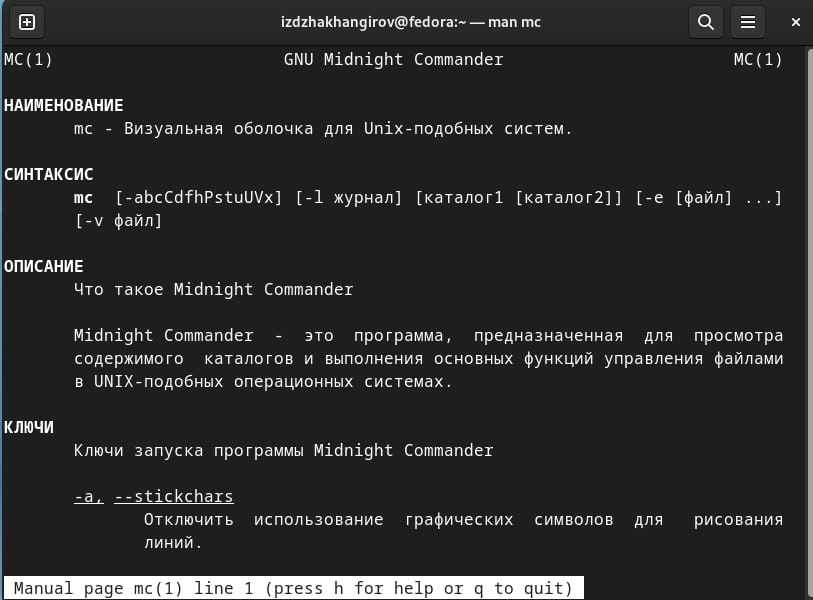

---
## Front matter
lang: ru-RU
title: отчёт по лабораторной работе номер
subtitle: отчет
author:
  - Джахангиров И.З
institute:
  - Российский университет дружбы народов, Москва, Россия
  - Объединённый институт ядерных исследований, Дубна, Россия
date: 01 января 1970

## i18n babel
babel-lang: russian
babel-otherlangs: english

## Formatting pdf
toc: false
toc-title: Содержание
slide_level: 2
aspectratio: 169
section-titles: true
theme: metropolis
header-includes:
 - \metroset{progressbar=frametitle,sectionpage=progressbar,numbering=fraction}
 - '\makeatletter'
 - '\beamer@ignorenonframefalse'
 - '\makeatother'
---

## Цель работы

Освоение основных возможностей командной оболочки Midnight Commander. Приоб-
ретение навыков практической работы по просмотру каталогов и файлов; манипуляций
с ними
## Задание
1. Изучите информацию о mc, вызвав в командной строке man mc.
2. Запустите из командной строки mc, изучите его структуру и меню.
3. Выполните несколько операций в mc, используя управляющие клавиши (операции
с панелями; выделение/отмена выделения файлов, копирование/перемещение фай-
лов, получение информации о размере и правах доступа на файлы и/или каталоги
и т.п.)
4. Выполните основные команды меню левой (или правой) панели. Оцените степень
подробности вывода информации о файлах.
5. Используя возможности подменю Файл , выполните:
- просмотр содержимого текстового файла;
- редактирование содержимого текстового файла (без сохранения результатов редактирования);
- создание каталога;
- копирование в файлов в созданный каталог.
6. С помощью соответствующих средств подменю Команда осуществите:
- поиск в файловой системе файла с заданными условиями (например, файла с расширением .c или .cpp, содержащего строку main);
- выбор и повторение одной из предыдущих команд;
- переход в домашний каталог;
- анализ файла меню и файла расширений.
7. Вызовите подменю Настройки . Освойте операции, определяющие структуру экрана mc
(Full screen, Double Width, Show Hidden Files и т.д.)ю

1. Создайте текстовой файл text.txt.
2. Откройте этот файл с помощью встроенного в mc редактора.
3. Вставьте в открытый файл небольшой фрагмент текста, скопированный из любого
другого файла или Интернета.
4. Проделайте с текстом следующие манипуляции, используя горячие клавиши:
- Удалите строку текста.
- Выделите фрагмент текста и скопируйте его на новую строку.
- Выделите фрагмент текста и перенесите его на новую строку.
- Сохраните файл.
- Отмените последнее действие.
- Перейдите в конец файла (нажав комбинацию клавиш) и напишите некоторый
текст.
- Перейдите в начало файла (нажав комбинацию клавиш) и напишите некоторый
текст.
- Сохраните и закройте файл.
5. Откройте файл с исходным текстом на некотором языке программирования (напри-
мер C или Java)
6. Используя меню редактора, включите подсветку синтаксиса, если она не включена,
или выключите, если она включена.

## Теоретическое введение
Командная оболочка — интерфейс взаимодействия пользователя с операционной систе-
мой и программным обеспечением посредством команд.
Midnight Commander (или mc) — псевдографическая командная оболочка для UNIX/Linux
систем. Для запуска mc необходимо в командной строке набрать mc и нажать Enter 
## Выполнение лабораторной работы
Описываются проведённые действия, в качестве иллюстрации даётся ссылка на иллюстрацию 

1. Изучите информацию  о mc, вызвав в командной строке man mc.

## Выполнение лабораторной работы

{ #fig:001 width=70% }

## Выполнение лабораторной работы

2. Запустите из командной строки mc, изучите его структуру и меню.

## Выполнение лабораторной работы

{ #fig:002 width=70% }

## Выполнение лабораторной работы

3. Выполните несколько операций в mc, используя управляющие клавиши (операции
с панелями; выделение/отмена выделения файлов, копирование/перемещение фай-
лов, получение информации о размере и правах доступа на файлы и/или каталоги
и т.п

## Выполнение лабораторной работы

{ #fig:003 width=70% }

## Выполнение лабораторной работы

4. Выполните основные команды меню левой (или правой) панели. Оцените степень
подробности вывода информации о файлах.

## Выполнение лабораторной работы

{ #fig:004 width=70% }
{ #fig:005 width=70% }

## Выполнение лабораторной работы

5. Используя возможности подменю Файл , выполните:
- просмотр содержимого текстового файла;
- редактирование содержимого текстового файла (без сохранения результатов редактирования);
- создание каталога;
- копирование в файлов в созданный каталог.

## Выполнение лабораторной работы

{ #fig:006 width=70% }
{ #fig:007 width=70% }

## Выполнение лабораторной работы

6. С помощью соответствующих средств подменю Команда осуществите:
- поиск в файловой системе файла с заданными условиями (например, файла с расширением .c или .cpp, содержащего строку main);
- выбор и повторение одной из предыдущих команд;
- переход в домашний каталог;
- анализ файла меню и файла расширений.

## Выполнение лабораторной работы

{ #fig:008 width=70% }
{ #fig:009 width=70% }

## Выполнение лабораторной работы

7. Вызовите подменю Настройки . Освойте операции, определяющие структуру экрана mc
(Full screen, Double Width, Show Hidden Files и т.д.)

## Выполнение лабораторной работы

{ #fig:010 width=70% }
{ #fig:011 width=70% }
{ #fig:012 width=70% }

## Выполнение лабораторной работы

1. Создайте текстовой файл text.txt.
2. Откройте этот файл с помощью встроенного в mc редактора.
3. Вставьте в открытый файл небольшой фрагмент текста, скопированный из любого
другого файла или Интернета.

## Выполнение лабораторной работы

{ #fig:013 width=70% }
{ #fig:015 width=70% }
{ #fig:015 width=70% }

## Выполнение лабораторной работы

4. Проделайте с текстом следующие манипуляции, используя горячие клавиши:
- Удалите строку текста.
- Выделите фрагмент текста и скопируйте его на новую строку.
- Выделите фрагмент текста и перенесите его на новую строку.
- Сохраните файл.
- Отмените последнее действие.
- Перейдите в конец файла (нажав комбинацию клавиш) и напишите некоторый
текст.
- Перейдите в начало файла (нажав комбинацию клавиш) и напишите некоторый
текст.
- Сохраните и закройте файл!
5. Откройте файл с исходным текстом на некотором языке программирования (напри-мер C или Java)
6. Используя меню редактора, включите подсветку синтаксиса, если она не включена,или выключите, если она включена.

## Список литературы
## (standout)
