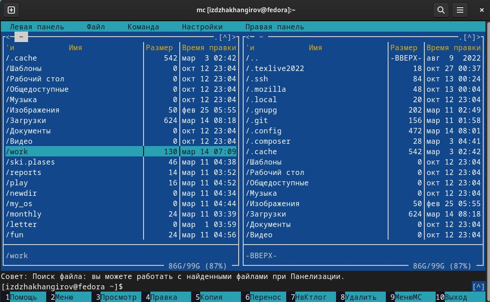
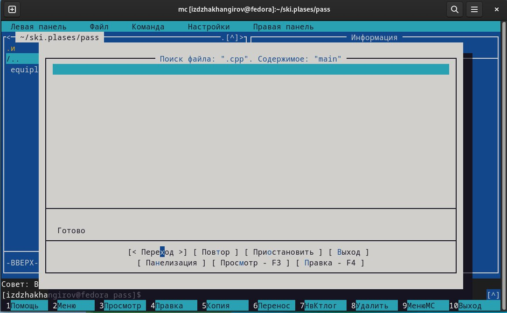
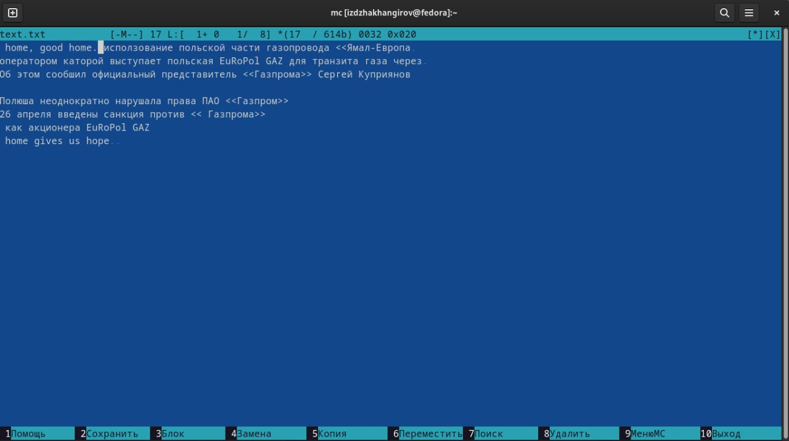

---
## Front matter
title: " отчёт по лабораторной работе номер 7"
subtitle: "комадная оболочка Midnight Сomander"
author: "Джахангиров Илгар"

## Generic otions
lang: ru-RU
toc-title: "Содержание"

## Bibliography
bibliography: bib/cite.bib
csl: pandoc/csl/gost-r-7-0-5-2008-numeric.csl

## Pdf output format
toc: true # Table of contents
toc-depth: 2
lof: true # List of figures
lot: true # List of tables
fontsize: 12pt
linestretch: 1.5
papersize: a4
documentclass: scrreprt
## I18n polyglossia
polyglossia-lang:
  name: russian
  options:
	- spelling=modern
	- babelshorthands=true
polyglossia-otherlangs:
  name: english
## I18n babel
babel-lang: russian
babel-otherlangs: english
## Fonts
mainfont: PT Serif
romanfont: PT Serif
sansfont: PT Sans
monofont: PT Mono
mainfontoptions: Ligatures=TeX
romanfontoptions: Ligatures=TeX
sansfontoptions: Ligatures=TeX,Scale=MatchLowercase
monofontoptions: Scale=MatchLowercase,Scale=0.9
## Biblatex
biblatex: true
biblio-style: "gost-numeric"
biblatexoptions:
  - parentracker=true
  - backend=biber
  - hyperref=auto
  - language=auto
  - autolang=other*
  - citestyle=gost-numeric
## Pandoc-crossref LaTeX customization
figureTitle: "Рис."
tableTitle: "Таблица"
listingTitle: "Листинг"
lofTitle: "Список иллюстраций"
lotTitle: "Список таблиц"
lolTitle: "Листинги"
## Misc options
indent: true
header-includes:
  - \usepackage{indentfirst}
  - \usepackage{float} # keep figures where there are in the text
  - \floatplacement{figure}{H} # keep figures where there are in the text
---

# Цель работы

Освоение основных возможностей командной оболочки Midnight Commander. Приоб-
ретение навыков практической работы по просмотру каталогов и файлов; манипуляций
с ними
# Задание
1. Изучите информацию о mc, вызвав в командной строке man mc.
2. Запустите из командной строки mc, изучите его структуру и меню.
3. Выполните несколько операций в mc, используя управляющие клавиши (операции
с панелями; выделение/отмена выделения файлов, копирование/перемещение фай-
лов, получение информации о размере и правах доступа на файлы и/или каталоги
и т.п.)
4. Выполните основные команды меню левой (или правой) панели. Оцените степень
подробности вывода информации о файлах.
5. Используя возможности подменю Файл , выполните:
- просмотр содержимого текстового файла;
- редактирование содержимого текстового файла (без сохранения результатов редактирования);
- создание каталога;
- копирование в файлов в созданный каталог.
6. С помощью соответствующих средств подменю Команда осуществите:
- поиск в файловой системе файла с заданными условиями (например, файла с расширением .c или .cpp, содержащего строку main);
- выбор и повторение одной из предыдущих команд;
- переход в домашний каталог;
- анализ файла меню и файла расширений.
7. Вызовите подменю Настройки . Освойте операции, определяющие структуру экрана mc
(Full screen, Double Width, Show Hidden Files и т.д.)ю

1. Создайте текстовой файл text.txt.
2. Откройте этот файл с помощью встроенного в mc редактора.
3. Вставьте в открытый файл небольшой фрагмент текста, скопированный из любого
другого файла или Интернета.
4. Проделайте с текстом следующие манипуляции, используя горячие клавиши:
- Удалите строку текста.
- Выделите фрагмент текста и скопируйте его на новую строку.
- Выделите фрагмент текста и перенесите его на новую строку.
- Сохраните файл.
- Отмените последнее действие.
- Перейдите в конец файла (нажав комбинацию клавиш) и напишите некоторый
текст.
- Перейдите в начало файла (нажав комбинацию клавиш) и напишите некоторый
текст.
- Сохраните и закройте файл.
5. Откройте файл с исходным текстом на некотором языке программирования (напри-
мер C или Java)
6. Используя меню редактора, включите подсветку синтаксиса, если она не включена,
или выключите, если она включена.

# Теоретическое введение
Командная оболочка — интерфейс взаимодействия пользователя с операционной систе-
мой и программным обеспечением посредством команд.
Midnight Commander (или mc) — псевдографическая командная оболочка для UNIX/Linux
систем. Для запуска mc необходимо в командной строке набрать mc и нажать Enter 
# Выполнение лабораторной работы
Описываются проведённые действия, в качестве иллюстрации даётся ссылка на иллюстрацию (рис. [-@fig:001])

1. Изучите информацию о mc, вызвав в командной строке man mc.
{ #fig:001 width=70% }

2. Запустите из командной строки mc, изучите его структуру и меню.
{ #fig:002 width=70% }

3. Выполните несколько операций в mc, используя управляющие клавиши (операции
с панелями; выделение/отмена выделения файлов, копирование/перемещение фай-
лов, получение информации о размере и правах доступа на файлы и/или каталоги
и т.п.)
{ #fig:003 width=70% }

4. Выполните основные команды меню левой (или правой) панели. Оцените степень
подробности вывода информации о файлах.
(рис. [-@fig:004;-@fig:005;])
{ #fig:004 width=70% }
{ #fig:005 width=70% }
5. Используя возможности подменю Файл , выполните:
- просмотр содержимого текстового файла;
- редактирование содержимого текстового файла (без сохранения результатов редактирования);
- создание каталога;
- копирование в файлов в созданный каталог.
(рис. [-@fig:006;-@fig:007;])
{ #fig:006 width=70% }
{ #fig:007 width=70% }
6. С помощью соответствующих средств подменю Команда осуществите:
- поиск в файловой системе файла с заданными условиями (например, файла с расширением .c или .cpp, содержащего строку main);
- выбор и повторение одной из предыдущих команд;
- переход в домашний каталог;
- анализ файла меню и файла расширений.
(рис. [-@fig:008;-@fig:009;])
{ #fig:008 width=70% }
{ #fig:009 width=70% }

7. Вызовите подменю Настройки . Освойте операции, определяющие структуру экрана mc
(Full screen, Double Width, Show Hidden Files и т.д.)
(рис. [-@fig:010;-@fig:011;-@fig:012;])
{ #fig:010 width=70% }
{ #fig:011 width=70% }
{ #fig:012 width=70% }
1. Создайте текстовой файл text.txt.
2. Откройте этот файл с помощью встроенного в mc редактора.
3. Вставьте в открытый файл небольшой фрагмент текста, скопированный из любого
другого файла или Интернета.
(рис. [-@fig:013;-@fig:014;-@fig:015;])
{ #fig:013 width=70% }
{ #fig:015 width=70% }
{ #fig:015 width=70% }
4. Проделайте с текстом следующие манипуляции, используя горячие клавиши:
- Удалите строку текста.
- Выделите фрагмент текста и скопируйте его на новую строку.
- Выделите фрагмент текста и перенесите его на новую строку.
- Сохраните файл.
- Отмените последнее действие.
- Перейдите в конец файла (нажав комбинацию клавиш) и напишите некоторый
текст.
- Перейдите в начало файла (нажав комбинацию клавиш) и напишите некоторый
текст.
- Сохраните и закройте файл!
5. Откройте файл с исходным текстом на некотором языке программирования (напри-мер C или Java)
6. Используя меню редактора, включите подсветку синтаксиса, если она не включена,или выключите, если она включена.
# контрольныц вопросы
1. Какие режимы работы есть в mc. Охарактеризуйте их.
анели могут допол-
нительно быть переведены в один из двух режимов: Информация или Дерево . В режиме
Информация (рис. 7.2) на панель выводятся сведения о файле и текущей файловой системе,
расположенных на активной панели. В режиме Дерево (рис. 7.3) на одной из панелей
выводится структура дерева каталогов.
2. Какие операции с файлами можно выполнить как с помощью команд shell, так и с по-
мощью меню (комбинаций клавиш) mc? Приведите несколько примеров.
С помощью последовательного применения комбинации клавиш Ctrl-x d есть
возможность сравнения каталогов, отображённых на двух панелях
3. Опишите структура меню левой (или правой) панели mc, дайте характеристику ко-мандам.

В меню каждой (левой или правой) панели можно выбрать Формат списка :
стандартный — выводит список файлов и каталогов с указанием размера и времени
правки;
ускоренный — позволяет задать число столбцов, на которые разбивается панель при
выводе списка имён файлов или каталогов без дополнительной информации;
 расширенный — помимо названия файла или каталога выводит сведения о правах
доступа, владельце, группе, размере, времени правки;
64 Лабораторная работа No 7. Командная оболочка Midnight Commander
 определённый пользователем — позволяет вывести те сведения о файле или каталоге,
которые задаст сам пользователь
4. Опишите структура меню Файл mc, дайте характеристику командам.
В меню Файл содержит перечень команд, которые могут быть применены к одному
или нескольким файлам или каталогам.
64 Лабораторная работа No 7. Командная оболочка Midnight Commander
определённый пользователем — позволяет вывести те сведения о файле или каталоге,
которые задаст сам пользователь.
Подпункт меню Порядок сортировки позволяет задать критерии сортировки при выводе
списка файлов и каталогов: без сортировки, по имени, расширенный, время правки,
время доступа, время изменения атрибута, размер, узел.
В меню Файл содержит перечень команд, которые могут быть применены к одному
или нескольким файлам или каталогам .
Команды меню Файл : Просмотр ( F3 ) — позволяет посмотреть содержимое текущего (или выделенного)
файла без возможности редактирования.
 Просмотр вывода команды ( М + ! ) — функция запроса команды с параметрами
(аргумент к текущему выбранному файлу). Правка ( F4 ) — открывает текущий (или выделенный) файл для его редактирования.
 Копирование ( F5 ) — осуществляет копирование одного или нескольких файлов или
каталогов в указанное пользователем во всплывающем окне место.
Права доступа ( Ctrl-x c ) — позволяет указать (изменить) права доступа к одному
или нескольким файлам или каталогам 
5. Опишите структураПереставить панели — меняет местами левую и правую панели.
Сравнить каталоги ( Ctrl-x d ) — сравнивает содержимое двух каталогов.
Размеры каталогов — отображает размер и время изменения каталога (по умолчанию
в mc размер каталога корректно не отображается).
История командной строки — выводит на экран список ранее выполненных в оболочке
команд.
Каталоги быстрого доступа ( Ctrl-\ ) — пр вызове выполняется быстрая смена текущего
каталога на один из заданного списка.
Восстановление файлов — позволяет восстановить файлы на файловых системах ext2
и ext3.
 Редактировать файл расширений — позволяет задать с помощью определённого син-
таксиса действия при запуске файлов с определённым расширением (например, какое
программного обеспечение запускать для открытия или редактирования файлов с рас-
ширением doc или docx).
Редактировать файл меню — позволяет отредактировать контекстное меню пользова-
теля, вызываемое по клавише F2 .
 Редактировать файл расцветки имён — позволяет подобрать оптимальную для поль-
зователя расцветку имён файлов в зависимости от их типа меню Команда mc, дайте характеристику командам.

6. Опишите структура меню Настройки mc, дайте характеристику командам.
еню Настройки содержит ряд дополнительных опций по внешнему виду и функцио-
нальности mc 
Меню Настройки содержит:
 Конфигурация — позволяет скорректировать настройки работы с панелями
Внешний вид и Настройки панелей — определяет элементы (строка меню, команд-
ная строка, подсказки и прочее), отображаемые при вызове mc, а также геометрию
расположения панелей и цветовыделение.
 Биты символов — задаёт формат обработки информации локальным терминалом.
Подтверждение — позволяет установить или убрать вывод окна с запросом подтвер-
ждения действий при операциях удаления и перезаписи файлов, а также при выходе
из программы.
 Распознание клавиш — диалоговое окно используется для тестирования функцио-
нальных клавиш, клавиш управления курсором и прочее.
 Виртуальные ФС –– настройки виртуальной файловой системы: тайм-аут, пароль
и прочее
7. Назовите и дайте характеристику встроенным командам mc.
F1 Вызов контекстно-зависимой подсказки
F2 Вызов пользовательского меню с возможностью создания и/или допол-
нения дополнительных функций
F3 Просмотр содержимого файла, на который указывает подсветка в ак-
тивной панели (без возможности редактирования)
F4 Вызов встроенного в mc редактора для изменения содержания файла,
на который указывает подсветка в активной панели
F5 Копирование одного или нескольких файлов, отмеченных в первой
(активной) панели, в каталог, отображаемый на второй панели
F6 Перенос одного или нескольких файлов, отмеченных в первой (актив-
ной) панели, в каталог, отображаемый на второй панели
F7 Создание подкаталога в каталоге, отображаемом в активной панели
F8 Удаление одного или нескольких файлов (каталогов), отмеченных в пер-
вой (активной) панели файлов
F9 Вызов меню mc
F10 Выход из m
8. Назовите и дайте характеристику командам встроенного редактора mc.
9. Дайте характеристику средствам mc, которые позволяют создавать меню, определяе-
мые пользователем.
10. Дайте характеристику средствам mc, которые позволяют выполнять действия, опреде-
ляемые пользователем, над текущим файлом.
# Выводы

Здесь кратко описываются итоги проделанной работы.

# Список литературы{.unnumbered}

::: {#refs}
:::
