---
## Front matter
lang: ru-RU
title: лаба 9
subtitle: EMACS
author:
  - джахангиров илгар
institute:
  - Российский университет дружбы народов, Москва, Россия
  

## i18n babel
babel-lang: russian
babel-otherlangs: english

## Formatting pdf
toc: false
toc-title: Содержание
slide_level: 2
aspectratio: 169
section-titles: true
theme: metropolis
header-includes:
 - \metroset{progressbar=frametitle,sectionpage=progressbar,numbering=fraction}
 - '\makeatletter'
 - '\beamer@ignorenonframefalse'
 - '\makeatother'
---

## Цель работы

Познакомиться с операционной системой Linux. Получить практические навыки рабо-
ты с редактором Emacs

## Задание
Последовательность выполнения работы
1. Ознакомиться с теоретическим материалом.
2. Ознакомиться с редактором emacs.
3. Выполнить упражнения.
4. Ответить на контрольные вопросы.

1. Открыть emacs.
2. Создать файл lab07.sh с помощью комбинации Ctrl-x Ctrl-f (C-x C-f).
3. Наберите текст:
4. Сохранить файл с помощью комбинации Ctrl-x Ctrl-s (C-x C-s).
5. Проделать с текстом стандартные процедуры редактирования, каждое действие долж-
но осуществляться комбинацией клавиш.
5.1. Вырезать одной командой целую строку (С-k).
5.2. Вставить эту строку в конец файла (C-y).
5.3. Выделить область текста (C-space).
5.4. Скопировать область в буфер обмена (M-w).
5.5. Вставить область в конец файла.
5.6. Вновь выделить эту область и на этот раз вырезать её (C-w).
5.7. Отмените последнее действие (C-/).
6. Научитесь использовать команды по перемещению курсора.
6.1. Переместите курсор в начало строки (C-a).
6.2. Переместите курсор в конец строки (C-e).
6.3. Переместите курсор в начало буфера (M-<).
6.4. Переместите курсор в конец буфера (M->).
7. Управление буферами.
7.1. Вывести список активных буферов на экран (C-x C-b).
.2. Переместитесь во вновь открытое окно (C-x) o со списком открытых буферов
и переключитесь на другой буфер.
7.3. Закройте это окно (C-x 0).
7.4. Теперь вновь переключайтесь между буферами, но уже без вывода их списка на
экран (C-x b).
8.2. В каждом из четырёх созданных окон откройте новый буфер (файл) и введите
несколько строк текста.
9. Режим поиска
9.1. Переключитесь в режим поиска (C-s) и найдите несколько слов, присутствующих
в тексте.
9.2. Переключайтесь между результатами поиска, нажимая C-s.
9.3. Выйдите из режима поиска, нажав C-g.
9.4. Перейдите в режим поиска и замены (M-%), введите текст, который следует найти
и заменить, нажмите Enter , затем введите текст для замены. После того как будут
подсвечены результаты поиска, нажмите ! для подтверждения замены.
9.5. Испробуйте другой режим поиска, нажав M-s o. Объясните, чем он отличается от
обычного режима

## Выполнение лабораторной работы

Описываются проведённые действия, в качестве иллюстрации даётся ссылка на иллюстрацию (рис. [-@fig:001])

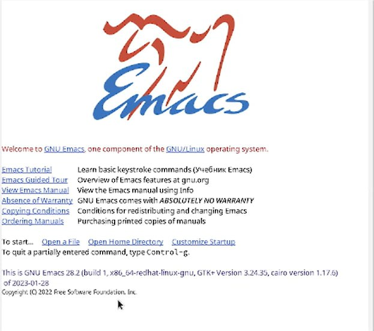{ #fig:001 width=70% }

## Выполнение лабораторной работы

1. Открыть emacs.

## Выполнение лабораторной работы

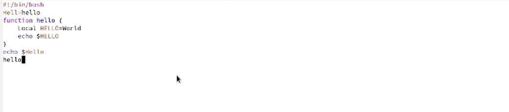{ #fig:002 width=70% }

## Выполнение лабораторной работы
2. Создать файл lab07.sh с помощью комбинации Ctrl-x Ctrl-f (C-x C-f).

## Выполнение лабораторной работы
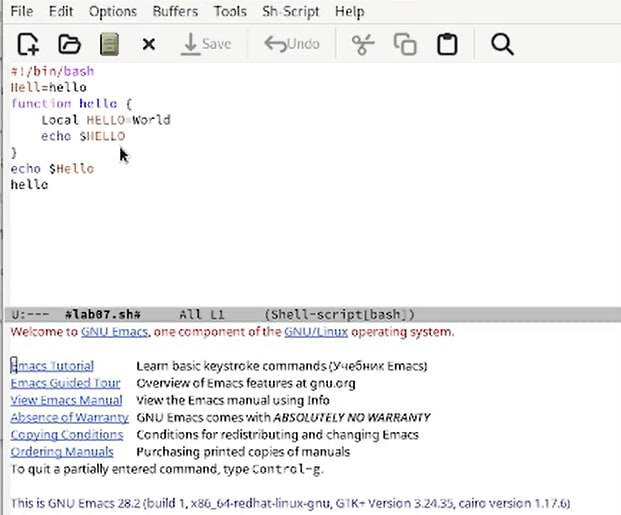{ #fig:003 width=70% }

## Выполнение лабораторной работы

3. Наберите текст:
4. Сохранить файл с помощью комбинации Ctrl-x Ctrl-s (C-x C-s).

## Выполнение лабораторной работы

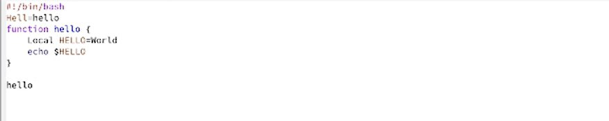{ #fig:004 width=70% }

## Выполнение лабораторной работы

5. Проделать с текстом стандартные процедуры редактирования, каждое действие долж-
но осуществляться комбинацией клавиш.
5.1. Вырезать одной командой целую строку (С-k).

## Выполнение лабораторной работы

{ #fig:005 width=70% }

## Выполнение лабораторной работы

5.2. Вставить эту строку в конец файла (C-y).

## Выполнение лабораторной работы

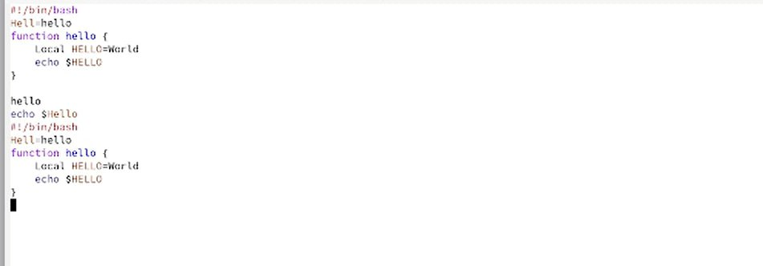{ #fig:006 width=70% }

## Выполнение лабораторной работы

5.3. Выделить область текста (C-space).
5.4. Скопировать область в буфер обмена (M-w).
5.5. Вставить область в конец файла.

## Выполнение лабораторной работы

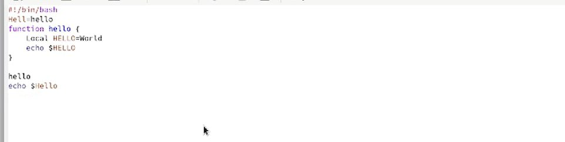{ #fig:007 width=70% }

## Выполнение лабораторной работы

5.6. Вновь выделить эту область и на этот раз вырезать её (C-w).

## Выполнение лабораторной работы

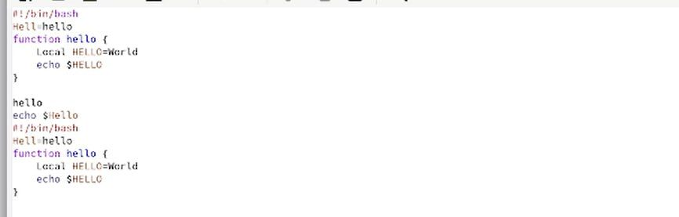{ #fig:008 width=70% }

## Выполнение лабораторной работы

5.7. Отмените последнее действие (C-/).

## Выполнение лабораторной работы

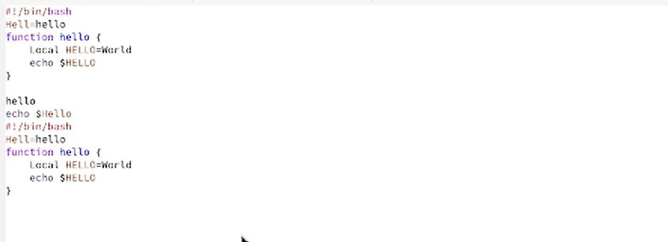{ #fig:009 width=70% }

## Выполнение лабораторной работы

6. Научитесь использовать команды по перемещению курсора.
6.1. Переместите курсор в начало строки (C-a).

## Выполнение лабораторной работы

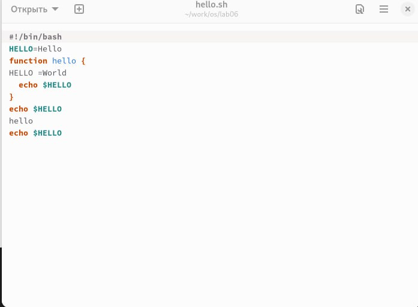{ #fig:010 width=70% }

## Выполнение лабораторной работы

6.2. Переместите курсор в конец строки (C-e).

## Выполнение лабораторной работы

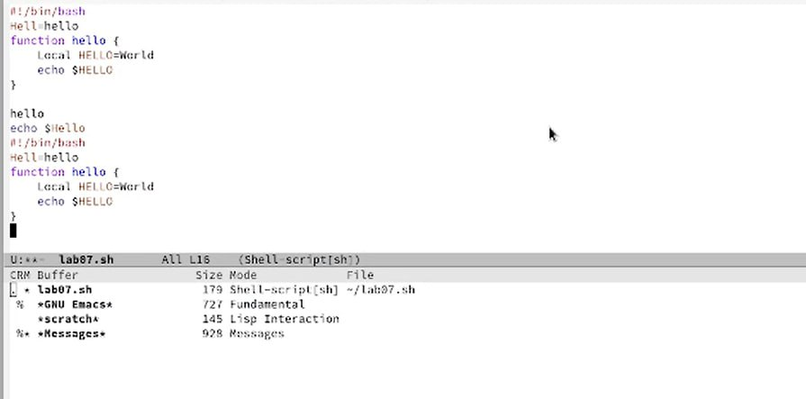{ #fig:011 width=70% }

## Выполнение лабораторной работы

6.3. Переместите курсор в начало буфера (M-<).
6.4. Переместите курсор в конец буфера (M->).
7. Управление буферами.
7.1. Вывести список активных буферов на экран (C-x C-b).

## Выполнение лабораторной работы

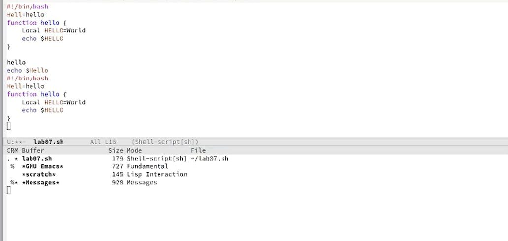{ #fig:012 width=70% }

## Выполнение лабораторной работы

7.2. Переместитесь во вновь открытое окно (C-x) o со списком открытых буферов
и переключитесь на другой буфер.
7.3. Закройте это окно (C-x 0).
7.4. Теперь вновь переключайтесь между буферами, но уже без вывода их списка на
экран (C-x b).
8.1. Поделите фрейм на 4 части: разделите фрейм на два окна по вертикали (C-x 3),
а затем каждое из этих окон на две части по горизонтали (C-x 2) 

## Выполнение лабораторной работы

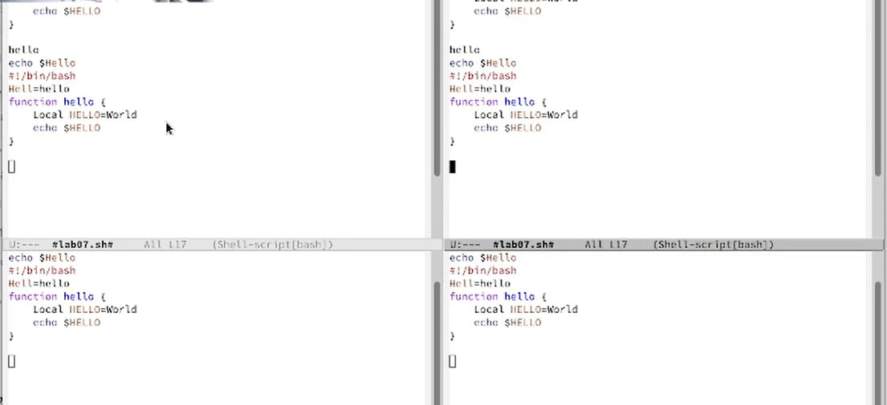{ #fig:013 width=70% }

## Выполнение лабораторной работы

8.2. В каждом из четырёх созданных окон откройте новый буфер (файл) и введите
несколько строк текста.

## Выполнение лабораторной работы

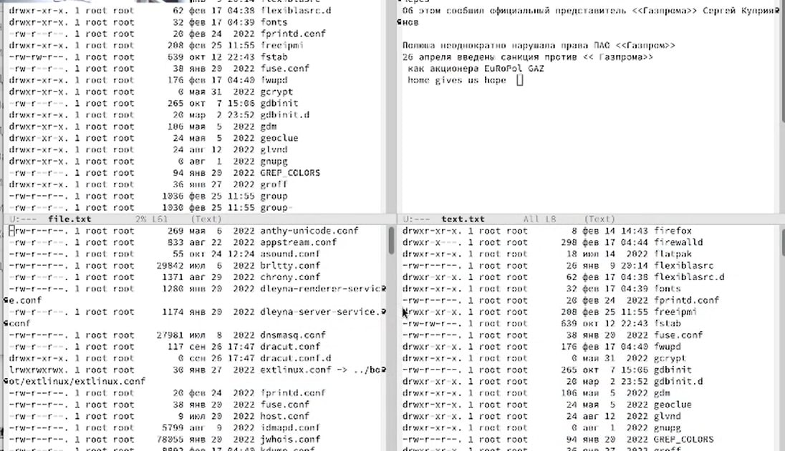{ #fig:14 width=70% }

## Выполнение лабораторной работы

9. Режим поиска
9.1. Переключитесь в режим поиска (C-s) и найдите несколько слов, присутствующих
в тексте.
9.2. Переключайтесь между результатами поиска, нажимая C-s.
9.4. Перейдите в режим поиска и замены (M-%), введите текст, который следует найти
и заменить, нажмите Enter , затем введите текст для замены. После того как будут
подсвечены результаты поиска, нажмите ! для подтверждения замены.

## Выполнение лабораторной работы

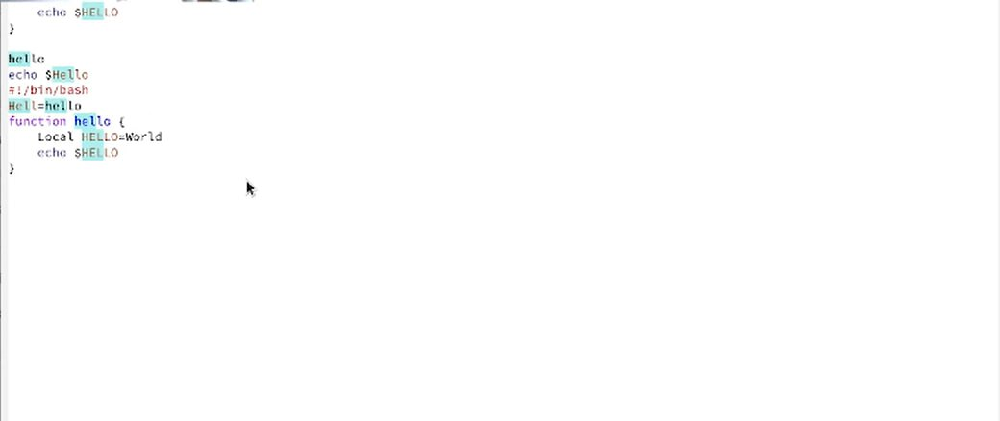{ #fig:015 width=70% }

## Выполнение лабораторной работы

9.5. Испробуйте другой режим поиска, нажав M-s o. Объясните, чем он отличается от
обычного режима

:::

